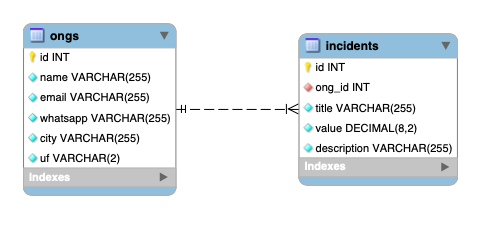

# Semana OmniStack 11

A Semana OmniStack é um workshop online produzido pela Rocketseat. Esta é a versão 11, onde o [Diego Fernandes](https://github.com/diego3g) nos ensina a desenvolver uma aplicação desde o backend até o frontend web e mobile com uma única linguagem, o Javascript. O nome da aplicação desenvolvida é Be The Hero, uma aplicação para cadastro de ONGs e casos cadastrados por elas para que outras pessoas possam ajudar a resolvê-los.

Para clonar o repositório, execute o seguinte comando no terminal:
```bash
git clone https://github.com/mateus-oliveira/omnistack11.git
``` 

## Banco de Dados 

A aplicação original foi feita com acesso ao banco de dados SQLite, mas nesta versão, fez-se uso do banco de dados [MySQL](https://www.mysql.com/) com o auxílio do [MySQL Workbench](https://www.mysql.com/products/workbench/) para visualização das tabelas diretamente no banco. 

O relacionamento das tabelas no banco é relativamente simples, pois possui são apenas duas tabelas, uma chamada ongs e outra incidents. A cardinalidade entre as duas é de 1 para N, pois uma ONG pode cadastrar vários incidentes a serem resolvidos, mas cada registro de incidente está relacionado apenas à ONG que o cadastrou. 

A imagem abaixo mostra uma foto do modelo conceitual do banco, montado no Workbench. Os arquivos do modelo conceitual e do script SQL estão na pasta [omnistack11/backend/src/database/workbench/](./backend/src/database/workbench/).



Para se conectar ao banco, mude suas credenciais user e password no arquivo [knexfile.js](./backend/knexfile.js). 

Em seguinda, para acessar o banco de dados desta aplicação no seu host, siga uma das opções a seguir:

### Opção 1

* Instale o MySQL e o Workbench;
* Execute com o Workbench o script [omnisctack.sql](./backend/src/database/workbench/omnistack.sql).

### Opção 2

* Instale o MySQL e o Workbench;
* Crie um banco de dados pelo Workbench com o nome omnistack;
* Selecione o Character Set uft8, e Collaction utf8_general_ci;
* Clique em Aplly > Aplly > Close.
* Execute os seguintes comandos no terminal:
```bash
cd backend
npm install --save
npx knex migrate:latest 
```

Com qualquer uma das opções acima, você conseguirá acessar o banco de dados.


## Backend

API Restful desenvolvida em [NodeJS](https://nodejs.org/en/) com acesso a banco de dados relacional. Esta API faz uso do query builder [Knex](http://knexjs.org/).

Para executar a API na sua máquina e servir, execute no terminal:

```bash
cd backend
npm install --save
npm run dev
```

As rotas para acessar a API estão no arquivo [routes.js](./backend/src/routes.js). Você pode testar as rotas antes de usar o frontend com o software [Insomnia](https://insomnia.rest/download/). Você só precisa baixar e instalar o Insomnia na sua máquina, e então basta importar o arquivo [requests.json](./backend/insomnia/requests.json) pelo Insomnia e acessar as rotas da aplicação. 

## Web

Frontend web, desenvolvido em [ReactJS](https://pt-br.reactjs.org/). Nesta parte da aplicação, é possível entender diversos conceitos do React e do desenvolvimento web em geral. Conceitos como componentes, funções, rotas da aplicação no frontend, e tudo sendo feito com Javascript, inclusive o próprio conteúdo HTML, que na verdade é um componente renderizado, através de uma função Javascript no arquivo [index.js](./frontend/src/index.js), todo o conteúdo HTML em uma tag div com id "root", no arquivo [index.html](./frontend/public/index.html), a qual é a página da aplicação.

Além disso, é muito importante entender como a página WEB normalmente se comunica com a API por meio de requisições HTTP, as quais retornam ao frontend como um objeto JSON (Java Script Object Notation). Neste caso, foi utilizada a biblioteca axios para realizar a comunicação com a API.

Para conseguir testar o frontend da aplicação, tenha certeza de ter feito as etapas anteriores, ou seja, criado o banco de dados e iniciado o serviço da API.

Para executar o frontend web no navegador, basta executar os seguintes comandos no terminal:
```bash
cd frontend
npm install --save
npm run start
```
Com isso, a página da aplicação Be The Hero será aberta. Nela, uma ONG poderá se cadastrar e cadastrar seus incidentes. Os incidentes poderão ser encontrados pelo app mobile, para que outras pessoas possam ajudar a resolvê-los.


## Mobile

Frontend mobile, desenvolvido com o framework [React Native](https://reactnative.dev/) com o [EXPO](https://expo.io/). Nesta parte da aplicação, é possível entender diversos conceitos do React Native e do desenvolvimento mobile em geral. Conceitos como componentes, funções, rotas de navegação, e tudo sendo feito com Javascript. 

Muito semelhante ao ReactJS e ao desenvolvimento web, no entanto, existem algumas pequenas difereças entre trabalhar com o React e o React Native, principalmente o fato de que no React Native sempre precisamos passar uma tag style que recebe um objeto com a estilização. Já no ReactJS, podemos podemos definir classes estilizadas, nas quais todos os objetos filhos dessa tag irão herdar esses estilos. 

Além disso, no ReactJS, os elementos em tela possuem um significado semântico, ou seja, tem-se tags como a tag p para parágrafo, header para cabeçalho, e por ai vai. Já no React Native, não há semântica nos elementos, ou seja, independente de onde queira mostrar um texto na tela no celular, sempre terá de usar a tag Text por exemplo.

No mais, é muito importante entender como o app mobile consegue se comunicar com a API por meio de requisições HTTP, as quais retornam ao frontend mobile como um objeto JSON (Java Script Object Notation), exatamente da mesma forma que o frontend web se comunica. Por isso, também foi utilizada a biblioteca axios para realizar a comunicação com a API.

Para conseguir testar o mobile da aplicação, tenha certeza de ter feito as etapas anteriores, ou seja, criado o banco de dados e iniciado o serviço da API.

Depois de clonar o repositório, basta executar os seguintes comandos no terminal:
```bash
cd mobile
npm install --save
npm run start
```
Com isso, uma página com o servidor local Metro Blunder será aberta, pelo EXPO. Nela aparecerá um QR Code, o qual você deverá escanear com o aplicativo Expo previamente instalado no seu celular. Após escanear, o aplicativo Be The Hero será instalado no seu celular.

Neste app, o usuário poderá ver os incidentes cadastrados pelas ONGs e poderá entrar em contato por meio de email ou whatsapp para poder ajudar a resolvê-los.